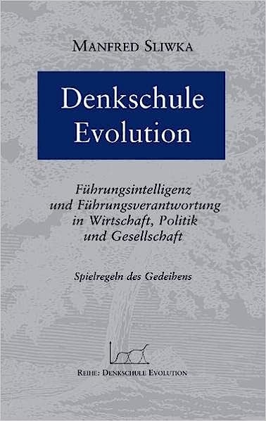

```{=html}
<div class="page-header-banner">
  <div class="container-main">
    <h1>Denkschule Evolution</h1>
  </div>
</div>

<div class="container-main mb-5">
  <div class="row g-5">
    <div class="col-md-4 text-center">
      
    </div>
    
    <div class="col-md-8">
      <h2 style="margin-top: 0;">Denkschule Evolution</h2>
      
      <p style="margin-bottom: 2rem;">
        Die Evolution ist die universelle und am längsten bewährte Entwicklungsmethode der Welt. Das Ergebnis dieses Entwicklungsprozesses ist das Gedeihen des Lebens in einer ungeheuren Vielfalt und Fülle. Menschen, die Entwicklungsverantwortung tragen für Unternehmen oder politische und gesellschaftliche Institutionen, können bei der Evolution in die Lehre gehen.
      </p>

      <p style="margin-bottom: 2rem;">
        Email an den Autor: "Exzellente Struktur, wertvolle Begrifflichkeiten, ein geistiger Werkzeugkasten von hohem Wert. Dank und Glückwunsch."
      </p>

      <p style="margin-bottom: 2rem;">
        Frau Prof. Dr. Elisabeth Noelle (Institut für Demoskopie Allensbach): "Die Kerngedanken Ihres Buches beschäftigen auch mich: Die 'Wertfelder', von denen Sie sprechen, verändern sich ja tatsächlich, und wir müssen immer neu lernen, was lebensdienlich ist. Gerade Menschen in Führungsverantwortung können viel dazu beitragen, dass auch andere ihre Kräfte 'ausfalten', wie der von Ihnen geschätzte Nicolaus von Cues sagt."
      </p>

      <p style="margin-bottom: 2rem;">
        Prof. Dr. Hans Küng, Tübingen, Gründer der Stiftung „Weltethos“: "... danke ich Ihnen für Ihr sehr interessantes Buch 'Denkschule Evolution'. Sie haben da einen sehr interessanten neuen Zugang zur Wertefrage in der Wirtschaft geschrieben. Ich werde mich sicher noch mehr damit beschäftigen können."
      </p>

      <p style="margin-bottom: 2rem;">
        Peter-Michael Thom, Vorsitzender des Vorstandes Gesellschaft zur Erforschung des Markenwesens e.V.: "Die inhaltliche Struktur der Themenaufbereitung, wie auch der angenehm sprech-deutsch gehaltene Schreibstil heben sich in wohltuender Weise von verklausulierten, um nicht zu sagen, manchmal verquasten, wissenschaftlichen Formulierungen ab."
      </p>

      <p style="margin-bottom: 2rem;">
        Rainer Scheerer: "Das ist mit Abstand eines der besten Bücher, die ich überhaupt gelesen habe. Das Thema wird klar erläutert und am Ende jedes Kapitels mit einer Quintessenz zusammengefasst. Denkschule!"
      </p>

      <div class="mt-4">
        <a href="index.html">&larr; Zurück zur Bücher-Übersicht</a>
      </div>
    </div>
  </div>
</div>
```
