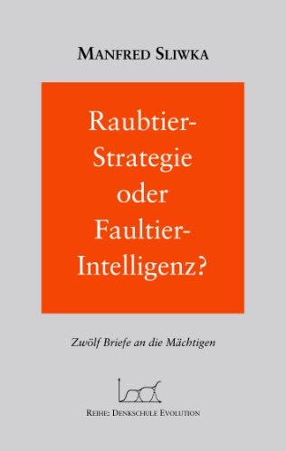

```{=html}
<div class="container-main">
  <div class="sites-title-box">
    <h1>Raubtier-Strategie oder Faultier-Intelligenz?</h1>
  </div>
  <hr class="sites-divider">
  <div class="row g-5 my-3">
    <div class="col-md-4 text-center">
      
    </div>
    <div class="col-md-8">
      <h2 style="margin-top: 0; color: #1c4587;">Raubtier-Strategie oder Faultier-Intelligenz?</h2>
      <p style="margin-bottom: 1.75rem;">Trierischer Volksfreund: "Mit seinem letzten Buch hat der renommierte Autor und Berater viele seiner Erkenntnisse, die er Führungskräften und auch jungen Menschen vermittelte, verständlich und als Appell zu werteorientiertem Handeln zusammengefasst - ohne erhobenen Zeigefinger."</p>
      <div class="mt-4"><a href="index.html" class="btn btn-outline-secondary btn-sm" style="border-radius: 20px;">&larr; Zurück zur Bücher-Übersicht</a></div>
    </div>
  </div>
</div>
```
