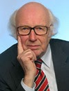

```{=html}
<div class="container-main">
  <div class="sites-title-box">
    <h1>Dr. Manfred Sliwka</h1>
  </div>

  <hr class="sites-divider">

  <div class="clearfix my-4">
    
    
    <p><strong>Das erfolgreichste Unternehmen der Welt</strong><br>
    Das erfolgreichste Unternehmen der Welt ist das Unternehmen "Leben". Es ist vor 3,5 Milliarden Jahren als "Ein-Mann-Betrieb", die Urzelle, gegründet worden. Es hat seine Krisen grandios gemeistert. Es hat seine Ressourcen geschont. Es hat immer neue "Produkte" (die Arten) entwickelt. Es hat immer neue "Marktnischen" besetzt. Es hat sein "Kapital" grandios gesteigert. Die große Bilanz: das Gedeihen des Lebens in einer riesigen Vielfalt und Fülle.</p>

    <p>Die Methode, mit der dieses Großunternehmen arbeitet, ist die Evolution. Sie ist die erfolgreichste Entwicklungsmethode der Welt, die Ur-Methode schlechthin, um Zukunft zu gewinnen. Deshalb können Manager bei der Evolution in die Lehre gehen. Das ist die entscheidende Erkenntnis, die zur Begründung der "Denkschule Evolution für Führungskräfte" geführt hat.</p>

    <p style="margin-top: 1.75rem;"><strong>Dr. Manfred Sliwka</strong> war promovierter Ökonom und Unternehmensberater mit dem Arbeitsschwerpunkt Führungsphilosophie und Unternehmenskultur. Herausgeber des Führungsbriefes "Philosophie und Methodik der Unternehmens-Evolution". Veröffentlichungen u. a. in Harvard Manager "Wenn Manager bei der Evolution in die Lehre gehen" und der Frankfurter Allgemeine Zeitung "Die Evolutionslehre im Management". Buchautor. 1996 Berufung in den "Club of Vienna", das internationale Expertenteam, das evolutionäre Wachstumsprozesse in Wirtschaft und Gesellschaft untersucht. Manfred Sliwka ist am 9. Dezember 2009 gestorben.</p>
  </div>
</div>
```
